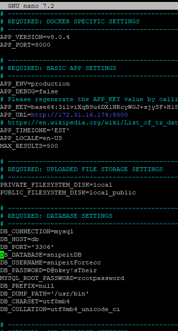
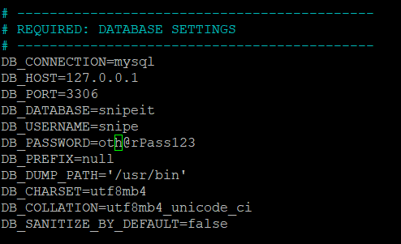

# Install:

Overview of steps:

[Installation](https://snipe-it.readme.io/docs/installation)

1) install Mysql 

2) install php

3) enable extensions present on php

4) add environment variables path of php and mysql.

5) install composer 

6) install larvel.

---

Prerequisites:

[Requirements](https://snipe-it.readme.io/docs/requirements)

inside the file php.ini present in the ProgramFiles/Php folder.

extension=gd

extension=zip

extension=sodium

pdo_mysql

openssl

mbstring

fileinfo

extension=pdo_sqlite
extension=sqlite3

curl

-- some additional extensions of the php

memory_limit = 256M

---

# Creating a Database and User

[Link](https://snipe-it.readme.io/edit/creating-a-database-and-user)

- Step 3:  Corrected Steps:
  
  1. **Create the User (if not already created)**
     
     sql
     
     CopyEdit
     
     `CREATE USER 'snipe_user'@'localhost' IDENTIFIED BY 'Mj@2692000';`
  
  2. **Grant Privileges**
     
     sql
     
     CopyEdit
     
     `GRANT ALL PRIVILEGES ON snipeit.* TO 'snipe_user'@'localhost';`
  
  3. **Apply Changes**
     
     sql
     
     CopyEdit
     
     `FLUSH PRIVILEGES;`

---

In future : 
REQUIRE_SAML : True in env.

---

config:
RootPassword: RootMysql

owner of folder:
ubuntu - ubuntu
www-data - storage and public/upload

portal admin:
username: admin
password: T!975258641684ax

---

on system:
user: ububntulocal
pass: Miteshj@2692000

---

login as user:
su - ubuntulocal

---

